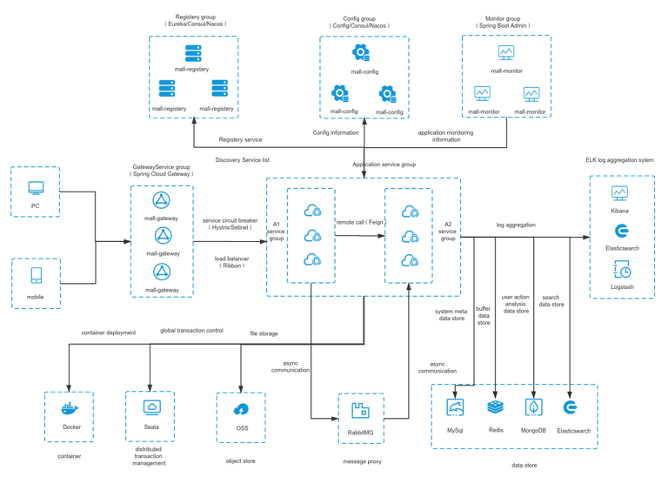

<h1 align="center">Welcome to msa-online-exam 👋</h1>

  
  
  

> MSA Online Exam, a new generation of microservice teaching management platform built on Spring Cloud, providing functions such as multi-tenancy, authority management, online exams, and exercises
>
> Question types support multiple choice questions, multiple choice questions, indefinite multiple choice questions, true or false questions, and short answer questions
>
> Support PC, H5, WeChat applet (open source behind the applet)

Test account:

| Unit ID | Account | Password | Role |
| --------- | -------- | -------- | -------- |
| gitee | preview | 123456 | Preview permissions|
| gitee | student | 123456 | student |
| gitee | teacher | 123456 | teacher |

## Technical Selection

- Service registration and discovery：`Consul`
- CircuitBreaker：`Hystrix` + `Turbine`
- Client load balancing：`Ribbon`
- Internal service call：`Feign`
- Gateway：`Spring Cloud Gateway`
- Authentication：`Spring Cloud OAuth2` + `JWT`
- Program monitoring：`Spring Boot Admin` / `Spring Boot Actuator`
- Distributed Configuration Center：`Spring Cloud Config`
- Distributed call chain monitoring：`Spring Cloud Sleuth` + `Zipkin`
- Database：`MySQL 5.7`
- Deployment：`Docker` + `docker-compose`
- Build tool：`Maven`
- Backend API document：`Swagger`
- Message queue：`RabbitMQ`
- File system：`本地目录`、`七牛云`、`FastDfs`
- Cache：`Redis`
- Cache：`vue`
- Mini Program：`wepy`

## Core dependencies

| Name | Version |
| --------- | -------- |
| `Spring Boot` | `2.2.5.RELEASE` |
| `Spring Cloud` | `Hoxton.SR3` |

## system structure

## Functional Overview

The project is divided into two parts: front-end website and back-end management. The front-end mainly provides examination functions, and the back-end provides basic management and examination management functions.

The front desk mainly provides online examination and online learning functions

Backstage management is divided into: homepage monitoring, system management, system monitoring, examination management, attachment management, personal management

Home page monitoring: Provides monitoring of the number of system tenants, users, exams, and exam records in the past seven days

System management: Provide basic management of users, departments, roles, permissions, etc.
- User management: add, delete, modify, check, import and export user information
- Department management: add, delete, modify and check department information
- Role management: adding, deleting, modifying, and checking role information, assigning permissions
- Menu management: add, delete, modify, check, import and export menu information
- Terminal management: manage OAuth2.0 clients, such as client_id, client_secret, access_token valid time, etc.
- Route management: gateway route management, including route additions, deletions, changes, and route refreshing

System monitoring: monitoring services, logs, etc.
- Log monitoring: view system logs
- `consul` monitoring: `consul` service monitoring
- `Zipkin` monitoring: monitoring service call link
- Service monitoring: `spring boot admin` service monitoring
- Interface document: `swagger api` document

Examination management: provide management of courses, examinations, question bank, grades, etc.
- Course management: add, delete, modify and check course information
- Exam management: examination information addition, deletion, modification, question management, release and recovery, question management supports simple text, rich text input, addition from the question bank, etc., question types support multiple choice questions, multiple choice questions, indefinite multiple choice questions, judgment questions, Short answer questions, generate QR code to share
- Question bank management: Question classification, addition, deletion, and modification of question information, topic information
- Score management: check scores, score correction, export and other functions
- Knowledge base: add, delete, modify and check the knowledge base, upload attachments

Attachment management: all attachments of the project are stored in `fastDfs`, providing a unified management entry
- Attachment list: Manage all attachments, such as user avatars, exam attachments, knowledge base attachments, etc. The storage mode supports server local directory, `fastDfs`, Qiniu Cloud

Personal management: manage personal information and change password
- Personal information: modification of basic information such as name and profile picture
- Modify password: modify password

***